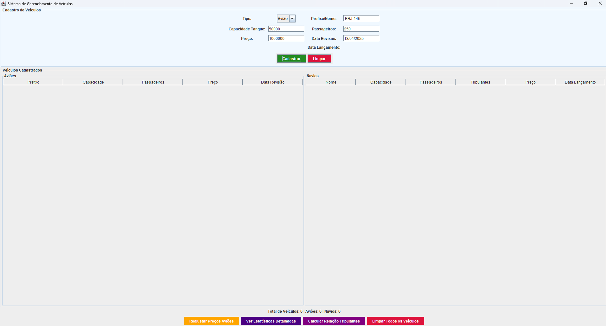
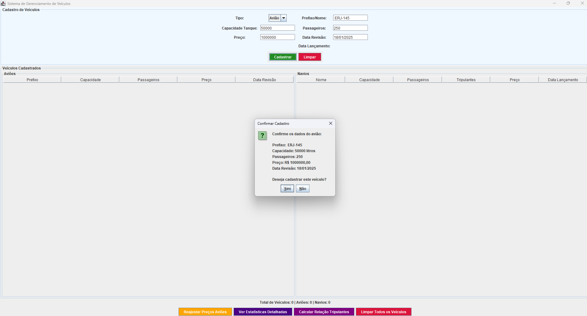
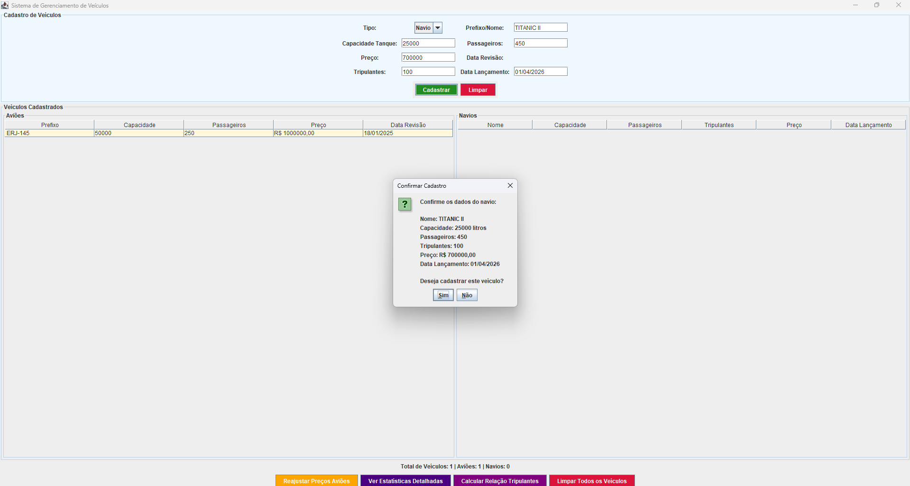
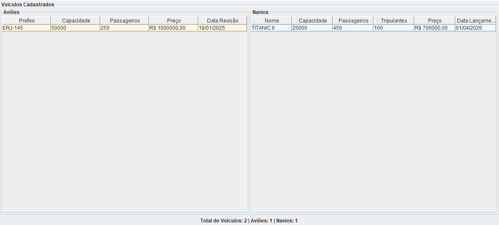
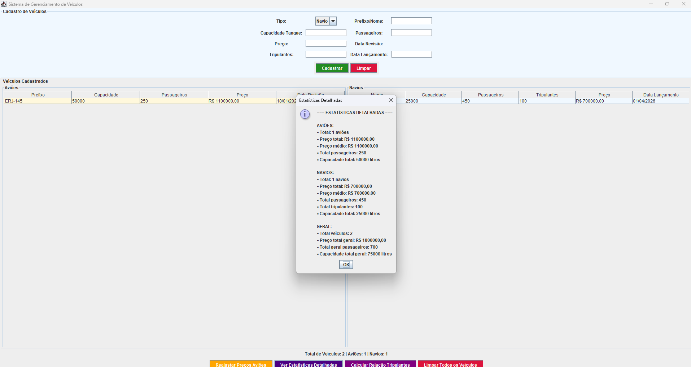
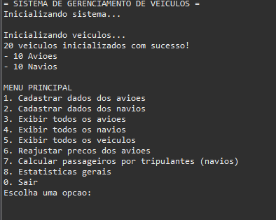

# Sistema de Gerenciamento de Veículos

## 📋 Descrição

Este é um projeto acadêmico desenvolvido em Java que implementa um sistema de gerenciamento de veículos (aviões e navios) utilizando conceitos de Programação Orientada a Objetos (POO). O sistema permite cadastrar, visualizar e gerenciar informações de diferentes tipos de veículos através de uma interface tanto em linha de comando quanto gráfica.

## 🎯 Objetivos Acadêmicos

- **Herança**: Implementação de hierarquia de classes com superclasse `Veiculo` e subclasses `Aviao` e `Navio`
- **Polimorfismo**: Uso de métodos abstratos e sobrescrita de métodos
- **Encapsulamento**: Controle de acesso aos atributos através de getters e setters
- **Tratamento de Exceções**: Validação de entrada e tratamento de erros
- **Interface Gráfica**: Desenvolvimento de interface usando Java Swing
- **Estruturas de Dados**: Uso de vetores e listas para armazenamento

## 🏗️ Arquitetura do Sistema

### Classes Principais

- **`Veiculo`** (Classe Abstrata)
  - Atributos comuns: capacidade do tanque, número de passageiros, preço
  - Métodos abstratos: `imprimir()` e `entrada()`
  - Método comum: `reajustarPreco()`

- **`Aviao`** (Subclasse de Veiculo)
  - Atributos específicos: prefixo, data de revisão
  - Implementação dos métodos abstratos da superclasse

- **`Navio`** (Subclasse de Veiculo)
  - Atributos específicos: nome, número de tripulantes, data de lançamento
  - Método específico: `passageirosPorTripulantes()`

- **`AplicacaoVeiculos`** (Aplicação Principal)
  - Sistema de menu interativo
  - Gerenciamento de vetor de veículos
  - Operações de cadastro, visualização e estatísticas

- **`InterfaceGrafica`** (Interface Gráfica)
  - Interface visual usando Java Swing
  - Tabelas para exibição de dados
  - Formulários de cadastro interativos

## 📸 Demonstração do Sistema

### Interface Gráfica Principal

*Tela principal do sistema mostrando a interface completa com formulários de cadastro e tabelas organizadas*

### Cadastro de Avião
 (images/cadastro_aviao2.png)
*Formulário de cadastro de avião com todos os campos específicos: prefixo, capacidade, passageiros, preço e data de revisão*

### Cadastro de Navio

*Formulário de cadastro de navio incluindo campos específicos: nome, tripulantes, data de lançamento*

### Tabelas de Veículos

*Visualização das tabelas organizadas por tipo de veículo com dados cadastrados*

### Estatísticas do Sistema

*Relatório de estatísticas detalhadas mostrando totais, médias e capacidades*

### Sistema de Linha de Comando

*Menu interativo do sistema de linha de comando com todas as opções disponíveis*

## 🚀 Funcionalidades

### Sistema de Linha de Comando
- Cadastro de aviões e navios
- Visualização de relatórios
- Reajuste de preços
- Cálculo de estatísticas
- Relação passageiros por tripulantes (navios)

### Interface Gráfica
- Cadastro visual de veículos
- Tabelas organizadas por tipo de veículo
- Estatísticas em tempo real
- Operações de reajuste e limpeza
- Interface intuitiva e responsiva

## 🛠️ Tecnologias Utilizadas

- **Java 8+**
- **Java Swing** (Interface Gráfica)
- **Conceitos de POO**: Herança, Polimorfismo, Encapsulamento
- **Tratamento de Exceções**
- **Estruturas de Dados**: Vetores, Listas

## 📁 Estrutura do Projeto

```
SistemaVeiculos/
├── src/
│   └── veiculos/
│       ├── Veiculo.java          # Classe abstrata base
│       ├── Aviao.java            # Subclasse para aviões
│       ├── Navio.java            # Subclasse para navios
│       ├── AplicacaoVeiculos.java # Aplicação principal
│       └── InterfaceGrafica.java  # Interface gráfica
├── bin/
│   └── veiculos/                 # Arquivos compilados (.class)
├── images/                       # Imagens de demonstração
│   ├── interface_principal.png
│   ├── cadastro_aviao.png
│   ├── cadastro_navio.png
│   ├── tabelas_veiculos.png
│   ├── estatisticas.png
│   └── sistema_console.png
└── README.md
```

## 🎓 Conceitos Acadêmicos Demonstrados

1. **Herança**: `Aviao` e `Navio` herdam de `Veiculo`
2. **Polimorfismo**: Métodos `imprimir()` e `entrada()` implementados diferentemente
3. **Encapsulamento**: Atributos privados com acesso controlado
4. **Classes Abstratas**: `Veiculo` define contrato para subclasses
5. **Tratamento de Exceções**: Validação robusta de entrada
6. **Interface Gráfica**: Desenvolvimento de GUI com Swing
7. **Estruturas de Dados**: Gerenciamento de coleções de objetos

## 🚀 Como Executar

### Pré-requisitos
- Java 8 ou superior instalado
- Compilador Java (javac)

### Compilação
```bash
# Navegar para o diretório src
cd src

# Compilar todas as classes
javac veiculos/*.java

# Executar aplicação de linha de comando
java veiculos.AplicacaoVeiculos

# Executar interface gráfica
java veiculos.InterfaceGrafica
```

## 📊 Funcionalidades do Sistema

### Operações Disponíveis
- ✅ Cadastro de aviões e navios
- ✅ Visualização de relatórios por tipo
- ✅ Relatório geral de todos os veículos
- ✅ Reajuste de preços (aviões)
- ✅ Cálculo de estatísticas
- ✅ Relação passageiros/tripulantes (navios)
- ✅ Interface gráfica interativa
- ✅ Validação de dados de entrada

### Validações Implementadas
- Números não podem ser negativos
- Campos obrigatórios não podem estar vazios
- Tratamento de exceções para entrada inválida
- Confirmação antes de operações críticas

## 👨‍💻 Autor

**Jonathas Felipe**  
*Projeto desenvolvido para fins acadêmicos*

## 📝 Observações

Este projeto foi desenvolvido como parte de uma atividade acadêmica para demonstrar conceitos fundamentais de Programação Orientada a Objetos em Java. O código segue boas práticas de desenvolvimento e inclui documentação completa para facilitar o entendimento dos conceitos aplicados.

---

*Projeto acadêmico - Sistema de Gerenciamento de Veículos*
